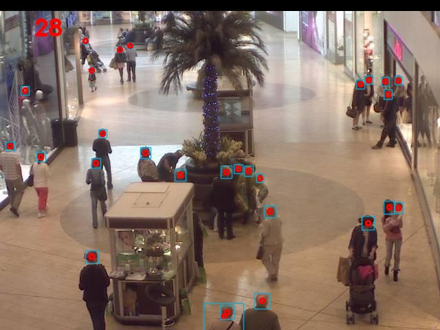

# Crowd-Counting-YOLOV5

This model was inspired by [yolov5-crowdhuman](https://github.com/deepakcrk/yolov5-crowdhuman) and it counts heads and people in images and videos.
The model was evaluated in [Mall Dataset](https://personal.ie.cuhk.edu.hk/~ccloy/downloads_mall_dataset.html)

# A video from results on Mall Dataset

[](https://youtu.be/XjtfAY3GVUs)

# Test
Please download the network weights from  [here](https://drive.google.com/file/d/1tNhSI_-Hq2AkwE12lqMRV_t9uTbX0b5i/view?usp=sharing), then copy it in Crowd-Counting-YOLOV5 directory

Download and extract Mall dataset
```
cd Crowd-Counting-YOLOV5
mkdir test-img
wget https://personal.ie.cuhk.edu.hk/~ccloy/files/datasets/mall_dataset.zip
unzip -q mall_dataset.zip -d test-img/
```

Run 
```
cd Crowd-Counting-YOLOV5
python3 detect.py --weights crowdhuman_yolov5m.pt --source test-img/mall_dataset/frames/ --view-img --save-txt --heads
```

An [ipynb file](MyHeadYOLOV5.ipynb) is provided for runuing this network on google colab


