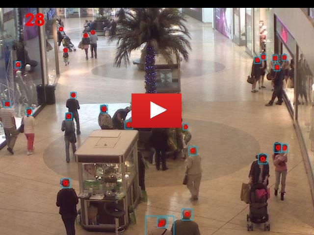

# Crowd-Counting-YOLOV5

This model was inspired by [yolov5-crowdhuman](https://github.com/deepakcrk/yolov5-crowdhuman) and it counts heads and people in images and videos.
The model was evaluated in [Mall Dataset](https://personal.ie.cuhk.edu.hk/~ccloy/downloads_mall_dataset.html)

# A video from results on Mall Dataset

